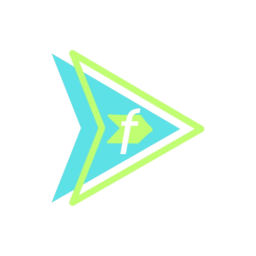

<h1 align="center">Dars Framework</h1>
 
<p align="center">
  
</p>

<p align="center">
  <em>Dars is a Python UI framework for building modern, interactive web apps with Python code. Write your interface in Python, export it to static HTML/CSS/JS, and deploy anywhere.</em>
</p>

```bash
pip install dars-framework
```

> Some Javascript or frontend stack required.

Try dars without installing nothing just visit the [Dars Playground](https://dars-playground.vercel.app/)

## How It Works
- Build your UI using Python classes and components (like Text, Button, Container, Page, etc).
- Preview instantly with hot-reload using `app.rTimeCompile()`.
- Export your app to static web files with a single CLI command.
- Use multipage, layouts, scripts, and more—see docs for advanced features.
- For mor information visit the [Documentation](https://ztamdev.github.io/Dars-Framework/documentation.html)

## Quick Example: Your First App
> Note: this is an single page example but you can build multipage apps with Page component see the [Components Documentation](https://ztamdev.github.io/Dars-Framework/documentation.html#dars-components-documentation) to know more.

```python
from dars.all import *

app = App()

# Crear aplicación con sintaxis nueva (v1.0.3)
container = Container(
    Text(
        "Hola Dars",
        style={'font-size': '32px', 'color': '#333'}
    ),
    Button(
        "Hacer clic",
        style={'background-color': '#007bff', 'color': 'white'}
    ),
    style={
        'display': 'flex',
        'flex-direction': 'column',
        'align-items': 'center',
        'padding': '40px'
    }
)

# Script para interactividad
script = InlineScript("""
document.addEventListener('DOMContentLoaded', function() {
    const boton = document.querySelector('button');
    boton.addEventListener('click', function() {
        alert('Hola desde Dars.');
    });
});
""")

# Ensamblar aplicación
app.set_root(container)
app.add_script(script)

if __name__ == "__main__":
    app.rTimeCompile()  # Live preview at http://localhost:8000

```

---

## Reactivity and State System

**Dars Framework** includes a built-in **reactive state system** (`dState` / `cState`) that allows dynamic and modular DOM updates directly from Python.
It enables fully event-driven interfaces without requiring manual JavaScript.

### Key Concepts

* **`dState(name, component, states)`**
  Creates a reactive state controller bound to a specific component and a list of possible states.

* **`cState(idx, mods=[...])`**
  Defines rules (modifications) that are automatically applied when entering a specific state.

* **`Mod` Helpers**
  A compact way to modify DOM elements on state changes: `inc`, `dec`, `set`, `toggle_class`, `append_text`, `prepend_text`, `goto`, and more.

* **Deferred Mutations**
  Using `component.attr(..., defer=True)` or `component.mod(...)` inside a `cComp=True` state defers HTML updates until an event occurs, preventing authoring-time mutations.

### Example Template

A complete example demonstrating `dState`, `cState`, `Mod`, and deferred updates is available [here](https://github.com/ZtaMDev/Dars-Framework/blob/CrystalMain/dars/templates/examples/advanced/dState/state_mods_demo.py)

### Features

* Reactive Mod system with compact `Mod` helpers
* Unified event model — any component can use `on_*` props (`on_click`, `on_input`, `on_change`, etc.)
* Deferred rendering for safer, predictable state transitions (`cComp=True`)
* Navigation between states using `goto`, including relative moves (`'+1'`, `'-1'`)
* Consistent, event-time mutation flow for reliable behavior

---

## CLI Usage
| Command                                 | What it does                               |
|-----------------------------------------|--------------------------------------------|
| `dars export my_app.py --format html`   | Export app to HTML/CSS/JS in `./my_app_web` |
| `dars preview ./my_app_web`             | Preview exported app locally                |
| `dars init my_project`                  | Create a new Dars project (also creates dars.config.json) |
| `dars init --update`                    | Create/Update dars.config.json in current dir |
| `dars build`                            | Build using dars.config.json (entry/outdir/format) |
| `dars config validate`                  | Validate dars.config.json and print report   |
| `dars info my_app.py`                   | Show info about your app                    |
| `dars formats`                          | List supported export formats               |
| `dars --help`                           | Show help and all CLI options               |

## More

- Visit dars [official website](https://ztamdev.github.io/Dars-Framework/)
- Visit the dars official [Documentation](https://ztamdev.github.io/Dars-Framework/documentation.html) now on separate website.
- Try dars without installing nothing just visit the [Dars Playground](https://dars-playground.vercel.app/)

## Local Execution and Live Preview

To test your app locally before exporting, use the hot-reload preview from any Python file that defines your app:

```python
if __name__ == "__main__":
    app.rTimeCompile()
```

Then run your file directly:

```bash
python my_app.py
```

This will start a local server at http://localhost:8000 so you can view your app in the browser—no manual export needed. You can change the port with:

```bash
python my_app.py --port 8088
```

---

You can also use the CLI preview command on an exported app:

```bash
dars preview ./my_exported_app
```

This will start a local server at http://localhost:8000 to view your exported app in the browser.

---

## Project Configuration (dars.config.json)

Dars can read build/export settings from a `dars.config.json` at your project root. It is created automatically by `dars init`, and you can add it to existing projects with `dars init --update`.

Example default:

```json
{
  "entry": "main.py",
  "format": "html",
  "outdir": "dist",
  "publicDir": null,
  "include": [],
  "exclude": ["**/__pycache__", ".git", ".venv", "node_modules"],
  "bundle": false
}
```

- `entry`: Python entry file. Used by `dars build` and `dars export config`.
- `format`: Export format. Currently only `html` is supported.
- `outdir`: Output directory. Used by `dars build` and default for `dars export` when not overridden.
- `publicDir`: Folder (e.g., `public/` or `assets/`) copied into the output. If null, it is autodetected.
- `include`/`exclude`: Basic filters for copying from `publicDir`.
- `bundle`: Reserved for future use. CLI exports and build already bundle appropriately.

Validate your config:

```bash
dars config validate
```

Build using config:

```bash
dars build
```

Export using the config entry and outdir:

```bash
dars export config --format html
```

